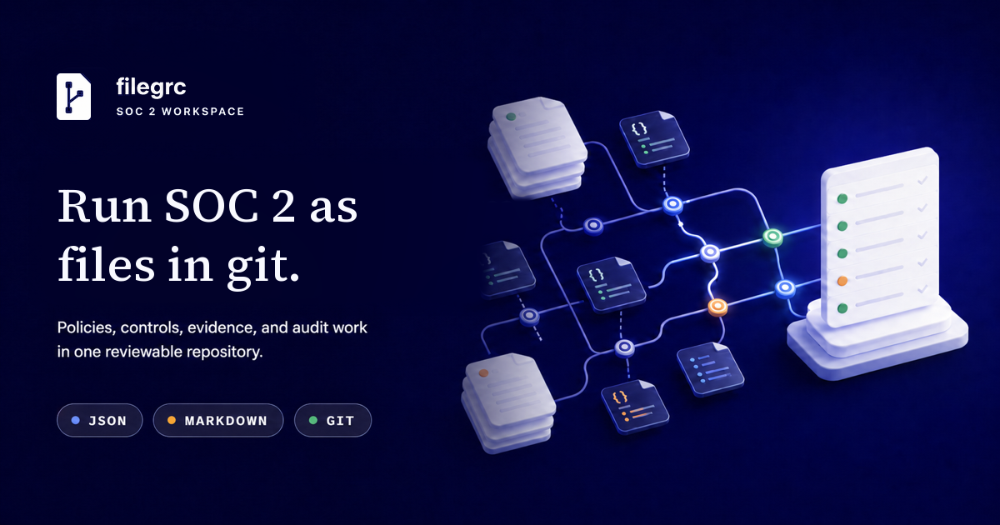
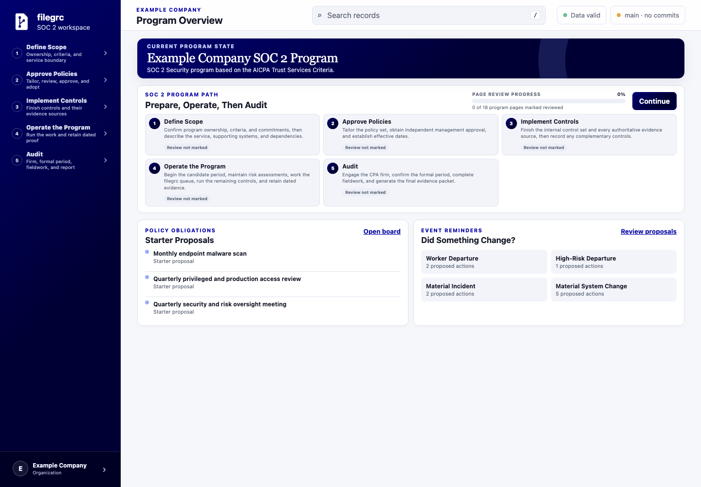

# filegrc



Run a SOC 2 program as files in Git.

filegrc gives founder-led engineering teams one place to adopt policies, implement controls, run recurring work, collect evidence, and prepare an audit.

It is open source, MIT licensed, and runs locally.

Use a dedicated private repository for your FileGRC workspace. The browser commits and pushes each saved program change, so a standalone repository keeps the compliance audit trail separate from application development history.

```sh
npx create-filegrc@latest company-grc
cd company-grc
npm run validate
npm run serve
```

Requires Node.js 20 or newer and Git.

## How it works

The repository is the program. There is no separate application database.

- **JSON** holds records that filegrc validates, filters, and connects.
- **Markdown** holds policies, procedures, plans, minutes, and narratives.
- **Git** supplies authors, timestamps, revisions, diffs, and commit messages.

Use the same source through the local web app, a text editor, the CLI, or CI. Browser and CLI actions call the same rules, so engineers and agents see the same validation and readiness results.

New workspaces use `main` as the authoritative browser branch. Browser saves fetch and fast-forward from `origin`, validate the change, and create a focused local commit. The UI then unlocks for navigation while Git push continues in the background. Other writes remain locked until the Repository status confirms `Synced`; a failed push keeps the local commit and offers Retry sync. Draft, proposed, approved, and retired records all live on that branch because record status, not a Git branch, represents approval.

Detached and feature-branch checkouts are read-only in the browser by default. Developers can run `npx filegrc serve --allow-non-authoritative-writes` for local task-worktree edits; that override never commits or pushes. Existing workspaces without `repositoryMode` keep manual browser Git behavior. CLI and agent workflows continue to manage Git explicitly.

## One path from setup to audit



1. **Define scope.** Confirm people, dated appointments, teams, criteria, commitments, vendors, and in-scope systems. For Systems that produce evidence, add their source roles, access owners, and retrieval instructions.
2. **Approve policies.** Tailor the proposals and record separate owners and reviewers.
3. **Implement controls.** Add the real procedure, scope, cadence, and authoritative evidence Systems. Confirm every source is active and has the required role, access owners, and repeatable retrieval instructions before marking the Control implemented.
4. **Operate the program.** Work the queue, trigger Policy Events, maintain risks, and preserve dated evidence.
5. **Audit.** Record the CPA engagement and agreed period, support fieldwork, and build the packet.

Control implementation includes evidence-source readiness. Use `npx filegrc program-readiness --json` to find incomplete Control or System records. `npx filegrc evidence-map --json` remains available as a focused diagnostic. Create External Evidence during Step 4 only when a real export, report, screenshot, signed file, or approved external reference exists.

The Program Overview shows what is done, what is blocked, and what to do next.

## The routine work stays connected

- **Work Queue** turns policy schedules and follow-up into upcoming, due, and overdue work.
- **Policy Events** create the right tasks for hiring, departures, incidents, vendor changes, and other events.
- **Program Readiness** checks whether management can begin a reliable evidence period.
- **Audit Readiness** checks the engagement, period, documents, evidence, and Type 2 populations.
- **Evidence packets** collect the scoped records, attachments, history, indexes, and checksums for delivery.


Starter records connect policies, controls, owners, systems, evidence, and schedules. They are proposals, so review them against how your company actually works before approval.

## Built for engineers and agents

The browser is helpful, but it is not required. An agent can discover the model, inspect valid relationships, create records, complete scheduled work, trigger events, and check the result from the CLI.

```sh
npx filegrc program-path --next --json
npx filegrc guide risk-assessment --json
npx filegrc obligations --json
npx filegrc program-readiness --summary --json
npx filegrc audit-readiness audit-id --json
npx filegrc evidence-packet --audit audit-id
```

Read `AGENTS.md` and `data/AGENTS.md` inside a generated workspace for the full headless workflow.

## Clear boundaries

filegrc manages GRC records and audit evidence. Your workforce, identity, source control, infrastructure, monitoring, endpoint, backup, training, signature, procurement, and vendor systems still operate the controls and produce source evidence.

The independent CPA firm still selects samples, tests controls, evaluates exceptions, decides whether evidence is sufficient, and issues the SOC 2 report.

Do not put secrets or personal data that may need erasure into Git. The editable local server has no authentication and binds to loopback by default.

Learn more at [filegrc.com](https://filegrc.com) or [view the source on GitHub](https://github.com/Sunpeak-AI/filegrc).
