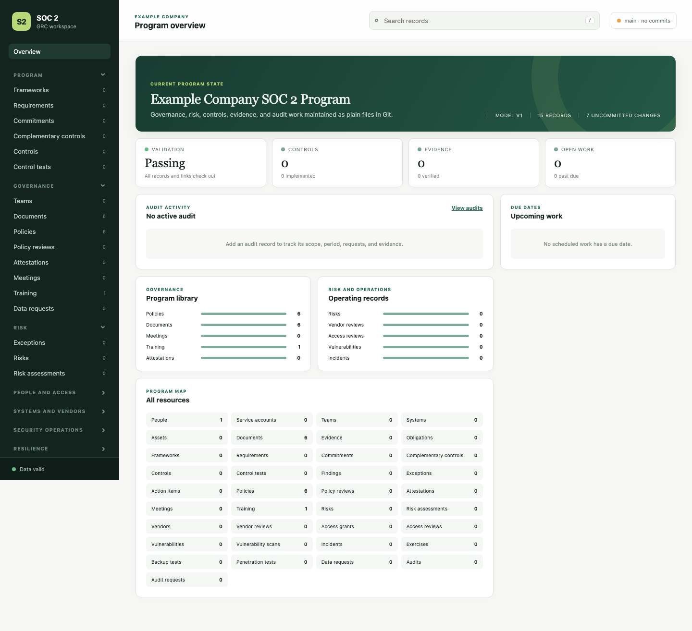

# SOC 2 program

This repository holds a plain-file SOC 2 GRC program. JSON files under `data/` hold structured records. Markdown files under `data/content/` hold policies, plans, training, minutes, and other long-form material. Git records the review trail.



## Use it

```sh
npm install
npm run validate
npm run serve
```

Open the local URL printed by `npm run serve`. The web app provides the program overview, resource pages, search, filters, validation results, and file editing. It never commits changes for you.

Run `npm run build` to create a read-only site under `.soc2/site/`. Commit the source records first, then pin evidence to the Git revision shown in the app when you provide rendered pages to an auditor.

Read `AGENTS.md` before changing records or adding automation.

## Scope

This repository manages GRC records and audit evidence. It does not replace identity systems, infrastructure logs, monitoring, endpoint controls, backups, vulnerability tooling, deployment controls, or incident detection. Record those systems and link their evidence here.

The included policies and training are starting material. Review them for your systems, contracts, laws, and actual practices before approval.
